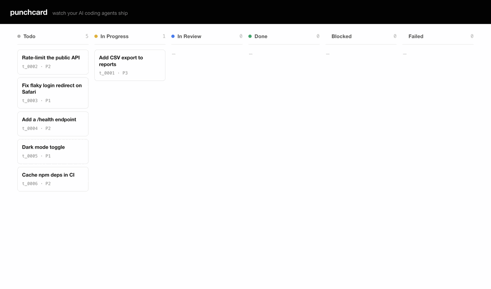

# punchcard

> Watch your AI coding agents ship — proof of work on every task, in one Go binary.



> The PM files tasks; the Engineer ships them as reviewed PRs with proof of work — all on one board. Reproduce it locally: `punch serve`, then `examples/demo-drive.sh`.

Punchcard is a dead-simple **board** for solo devs who delegate to AI coding agents:
queue the work, then watch your agents claim each task, ship a PR, and leave **proof
of work** — a gif or screenshot — as receipts. Every task starts with **fresh
context** and runs on one static Go binary with **no database**, no build step, no
Electron.

## Why
Fast (local single binary, no cloud round-trips) and context-clean (each task runs in
a fresh subagent, not one ballooning chat). No database, no framework — just Go stdlib.

## Install the binary
```bash
curl -fsSL https://raw.githubusercontent.com/ifokeev/punchcard/main/install.sh | sh
punch serve                   # board + API on http://127.0.0.1:8080
```
Prefer source? `git clone https://github.com/ifokeev/punchcard && cd punchcard && go build -o punch .` (Go 1.22+).

## Use it with Claude Code
The binary is only half of it — the agents are driven by a Claude Code **plugin**
(two skills + a command). Install it:
```text
/plugin marketplace add ifokeev/punchcard
/plugin install punchcard@punchcard
```
> Needs the repo public. No marketplace? Copy `skills/*` → `~/.claude/skills/` and
> `commands/*` → `~/.claude/commands/`, then `/reload-plugins`. Run `/help` to see
> what's installed.

- **PM skill** — in your chat session, turns your intent into well-scoped task briefs
  and files them on the board.
- **Engineer** — ships each task as a reviewed PR with proof of work, a fresh subagent
  per task. Run it two ways:

| Goal | Run | Behavior |
|---|---|---|
| Clear what's queued, then stop | `/punch-loop` | One-shot — drains the current queue within one turn, then ends. |
| Stay on, pick up new tasks | `/loop 5m /punch-loop` | The built-in `/loop` re-fires `/punch-loop` every 5 min, so tasks the PM files later get picked up. `Esc` to stop. |

> `/punch-loop` is a normal command: it loops only *within a turn* and won't see tasks
> filed afterward — wrap it in the built-in `/loop` for a long-running worker.

Open the board and watch tasks slide from todo → done in real time.

## Make it remote (pick one)
| Tier | How |
|---|---|
| Local | `punch serve` (binds 127.0.0.1) |
| Private mesh | `punch serve --addr 0.0.0.0:8080 --token $TOK` + Tailscale |
| Public zero-trust | the above + Cloudflare Tunnel + Access |

> Binding a non-loopback address without `--token` is refused (pass `--insecure` to
> override). Put Tailscale/Cloudflare in front; the bearer token is defense-in-depth.

To point the `punch` CLI (and every agent subagent) at a remote or token-protected
board, run once:
```bash
punch config set --url https://your-board.example.com --token <token>
punch config show   # confirm settings
```
This writes `~/.punch/config.json` (mode 0600). All subsequent `punch` calls — including
those made by dispatched subagents — read the file automatically. The environment
variables `PUNCH_URL` and `PUNCH_TOKEN` always override the config file when set.
